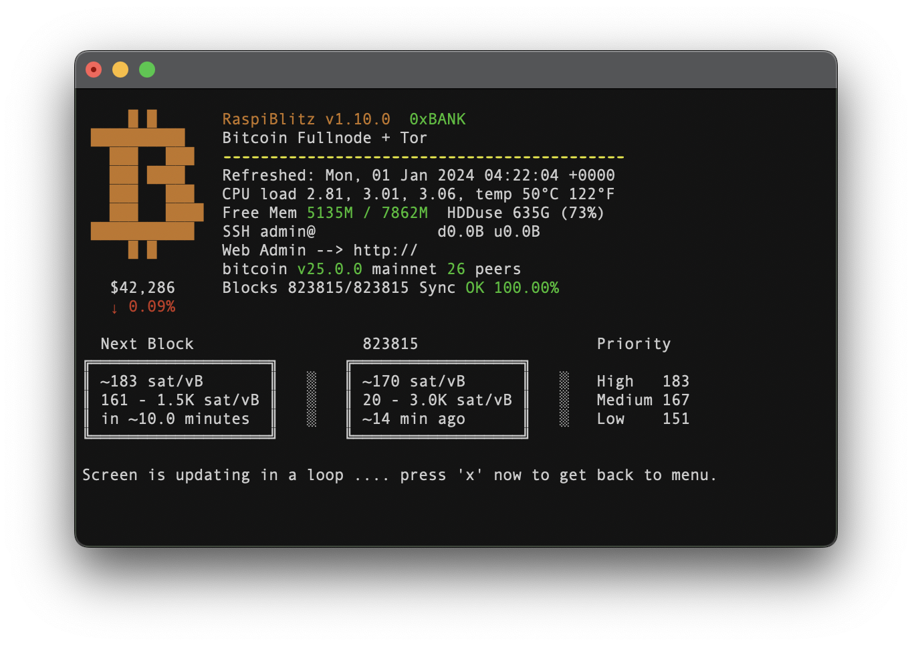

# Scott Modifications



Adds support for the following:

- 5" LCD
- Showing bitcoin price on screen
- Showing current block and next block mempool information
- Showing mempool fee priority values

## Installation

- Added `mempool.monitor.sh` & `price.monitor.sh` to the `/home/admin/config.scripts` and `chmod +x`.
- Modified `00infoBlitz.sh` and `_background.scan.sh`.

## 5" LCD screen support

[Screen I am using](https://www.elecrow.com/download/product/DIS00005R/Elecrow_RC050S_5_Inch_HDMI_Touchscreen_Monitor_User_Manual.pdf)

### config.txt

```
# config.txt

# --- added by elecrow-pitft-setup ---
hdmi_force_hotplug=1
max_usb_current=1
hdmi_drive=1
hdmi_group=2
hdmi_mode=1
hdmi_mode=87
hdmi_cvt 800 480 60 6 0 0 0
dtoverlay=ads7846,cs=1,penirq=25,penirq_pull=2,-speed=50000,keep_vref_on=0,swapxy=0,pmax=255,xohms=150,xmin=200,xmax=3900,ymin=200,ymax=3900
display_rotate=90
# --- end elecrow-pitft-setup ---
```

### Change terminal font size to fill screen

```
# edit file
sudo vim /etc/default/console-setup

# change font
FONTSIZE="12x24"

# restart console
sudo /etc/init.d/console-setup.sh restart
```

## TODO

Would be dope to add this ascii art but the font doesn't support these characters

```text
    ⣿⡇ ⢸⣿⡇
⠸⠿⣿⣿⣿⡿⠿⠿⣿⣿⣿⣶⣄
  ⢸⣿⣿⡇   ⠈⣿⣿⣿
  ⢸⣿⣿⡇  ⢀⣠⣿⣿⠟
  ⢸⣿⣿⡿⠿⠿⠿⣿⣿⣥⣄
  ⢸⣿⣿⡇    ⢻⣿⣿⣧
  ⢸⣿⣿⡇    ⣼⣿⣿⡿
⢰⣶⣿⣿⣿⣷⣶⣶⣾⣿⣿⠿⠛⠁
    ⣿⡇ ⢸⣿⡇
```
